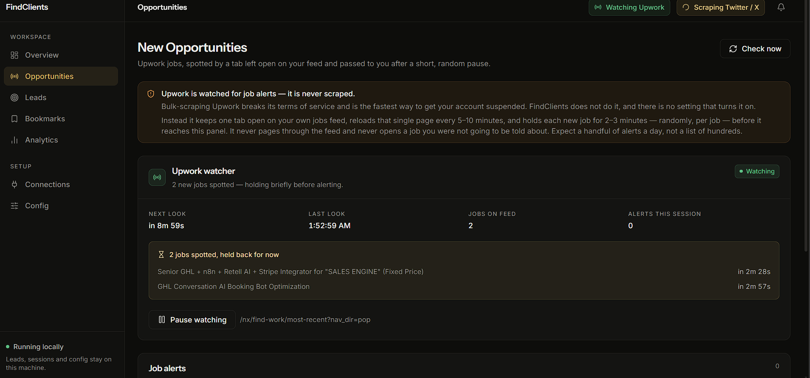
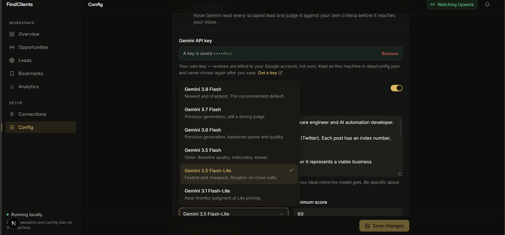

# FindClients | By Seekehr

Self-hosted lead discovery for freelancers. It watches Upwork for new job postings and scrapes X/Twitter for people who are hiring, optionally screens the X finds with Google Gemini, and puts it all in a dashboard.

**Upwork is watched, never scraped.** Paging through the Upwork feed pulling every listing breaks its terms of service and is the quickest way to lose the account. Instead FindClients keeps one tab open on the feed you already use, reloads that single page every 10–15 minutes (never more often than every 10), and tells you about a new job 2–3 minutes after it appears, randomly, per job. Those alerts land in **New Opportunities**. There is no setting that turns bulk Upwork collection on.

It runs **entirely on your own machine**. There is no account, no server to deploy and no database to install — one command starts it, and everything it knows lives in a folder you can delete.

## Preview

<p>
  
  
</p>

## Setup

Requires Node 22.5+.

```bash
npm run setup
```

That installs each workspace's dependencies, downloads the Chromium the scrapers drive, and creates `.env` from `.env.example`. Then:

```bash
npm start
```

Open **http://localhost:4000**. The first start builds the website (about a minute); every one after that is instant.

## Signing in

Start Chrome with debugging on, in its own persistent profile:

```bash
npm run chrome
```

Sign in to Upwork and X in that window, then **leave it open**. That is the whole setup. Every scrape — and the Upwork watcher's permanent tab — attaches to this browser over CDP and reuses the session, so you sign in once and never again. The profile lives in `data/chrome-profile/` and survives restarts.

You can also sign in from **Connections → Sign in**, which opens a login tab in that Chrome and notices on its own once you are in. Closing that tab cancels it; the rest of the browser stays open, and an X sign-in leaves the Upwork watcher running.

Then set your keywords in the app under **Config**.

**If CAPTCHA solving ever needs you**, the watcher pauses and waits for you to click through it in that same Chrome window. 
### Without the CDP setup

Leave `CHROME_CDP_URL` empty and FindClients launches its own persistent profile per platform in `data/browser/<platform>/`, using installed Chrome where it can. **Connections → Sign in** opens a window for you. This works fine for X; expect Cloudflare to block Upwork.

Either way, **Check** on the Connections page re-tests a saved session against the live site.

## Layout

| Folder | What it is |
| --- | --- |
| [`website/`](website) | Next.js 16 frontend (React 19, Tailwind 4) |
| [`server/`](server) | Express API + scheduler; also serves the built website |
| [`scrapper/`](scrapper) | Playwright scrapers ([details](scrapper/README.md)) |
| [`scripts/`](scripts) | `setup` / `start` / `dev` |
| `data/` | Your leads, config and browser profiles. Gitignored. Created on first run. |

The three workspaces are independent — no root `node_modules`, no npm workspaces — so the website's build tooling never ends up in the server's runtime. All three read the root `.env`.

## Commands

| Command | What it does |
| --- | --- |
| `npm run setup` | Install everything, once |
| `npm run chrome` | Start the Chrome that scrapes run in — sign in here, leave it open |
| `npm start` | Build if needed, then run the whole app on one port |
| `npm run dev` | API on :4000 and website on :3000, both reloading on save |

## Your data

Everything is JSON files in `data/`:

| File | What is in it |
| --- | --- |
| `config.json` | Your settings, and your Gemini API key |
| `leads.json` | Every lead, with its status, bookmark and AI verdict |
| `dismissed.json` | Source hashes of leads you cleared, so they stay cleared for 30 days |
| `opportunities.json` | The New Opportunities feed — Upwork job alerts (last 300) |
| `connections.json` | Which platforms are signed in, and how the last run went |
| `chrome-profile/` | The Chrome profile `npm run chrome` uses — your live sessions |
| `browser/` | Per-platform profiles, used only when not attaching over CDP |
| `runs.json` | Scrape history (last 200) |
| `notifications.json` | In-app feed (last 200) |

Backing up FindClients means copying that folder. Starting over means deleting it.

## Not getting your account flagged

Going local removes the shared-IP problem. It does not remove the *behavioural* one — a real account that hits the same feed every two minutes forever, at exactly the same offset, is still obviously automated. The defaults are set accordingly:

- `SCRAPE_CRON` is every **30 minutes**, not every 2.
- `SCRAPE_JITTER_MS` adds up to 2 minutes of random delay so runs don't land on a clean clock tick.
- `SCRAPE_ON_START` is **off**, so restarting the app doesn't hit the platforms again.

Turning these up is the fastest way to get the account you are scraping with restricted. The posts are not going anywhere.

## Not implemented

Discord / Reddit / LinkedIn scrapers (the platforms are listed in the UI and marked "no scraper yet").

## Disclaimer

Automating access to Upwork and X may violate their Terms of Service and can get the account you connect restricted or banned. Use accounts you own, at your own risk.

FindClients does not bulk-scrape Upwork, and the pacing defaults exist for a reason. Turning them down until the watcher behaves like a poller puts your account back in exactly the position this design avoids.

## License

MIT.
